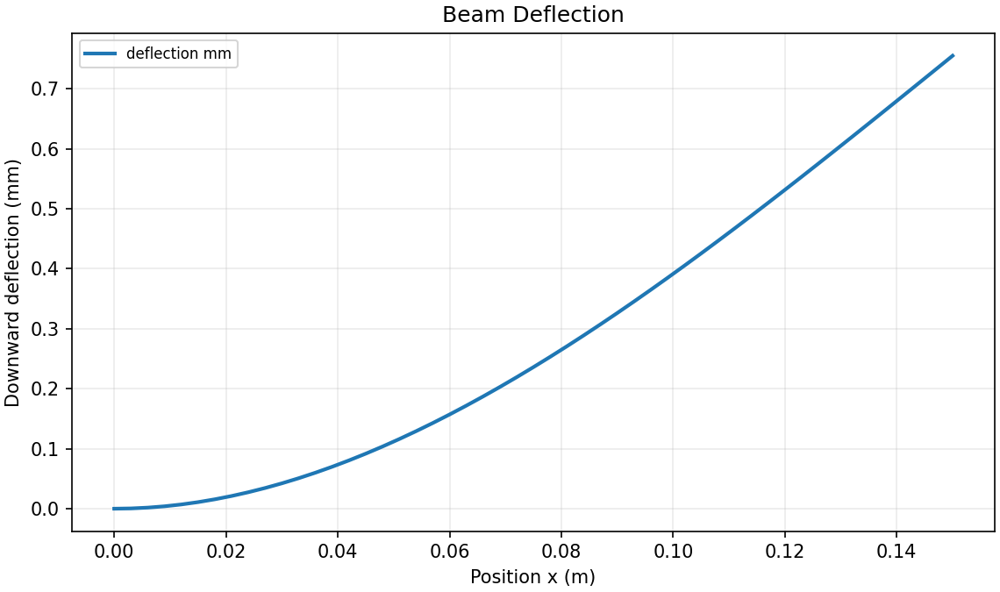
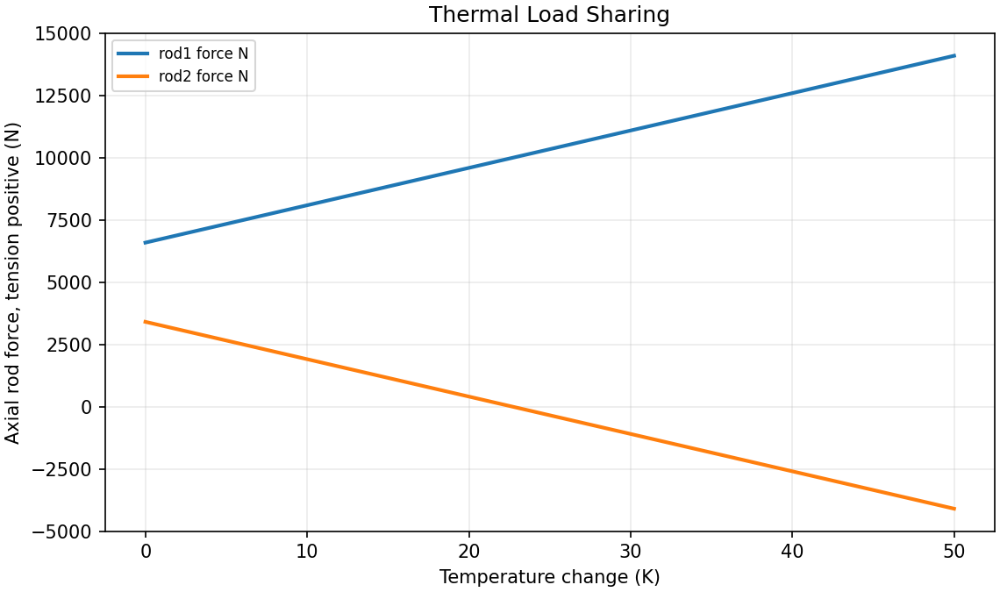
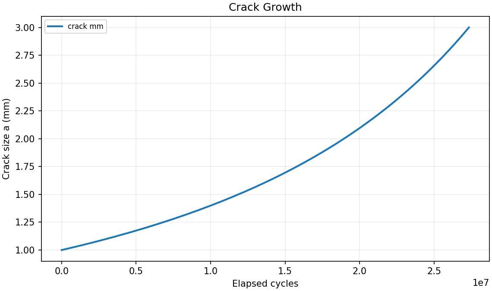
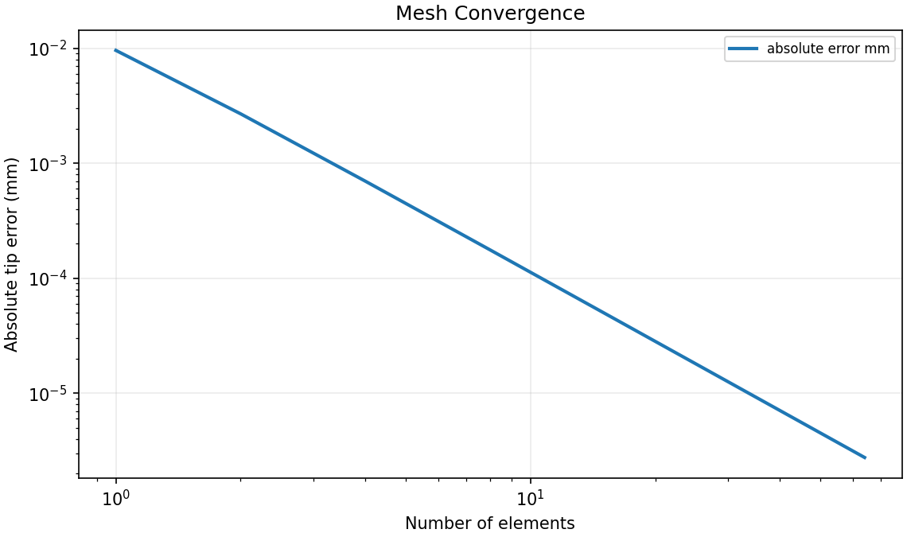

# Baseline plot gallery

These figures are generated from the included baseline inputs. Run
`python3 run_all.py --plot` to reproduce all plots.

## Cantilever deflection

The slope and displacement vanish at the fixed end; displacement is largest at the tip.

## Thermal load sharing

Heating can drive one rod into compression while the two forces still sum to the applied tensile load.

## Synthetic crack-growth study

For the assumed Paris relation, growth accelerates as the crack becomes longer. These synthetic cycles are not a material life prediction.

## Mesh convergence

The tapered bar creates a measurable displacement error that decreases with element refinement.
